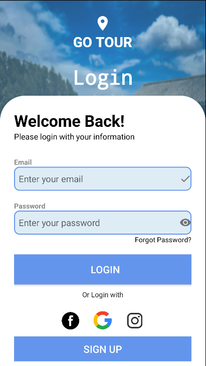
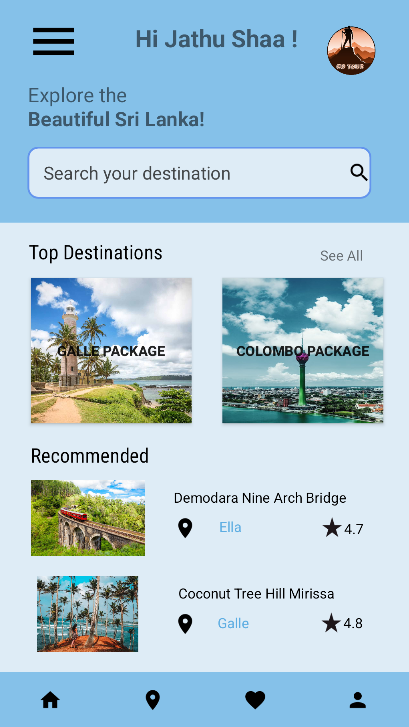
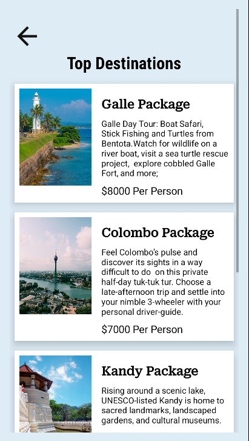
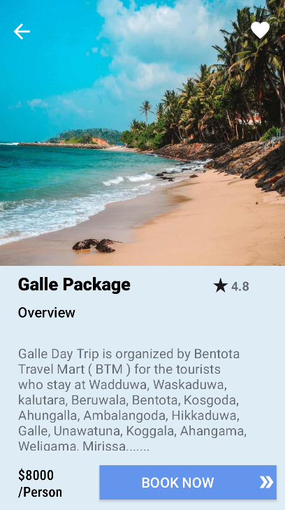
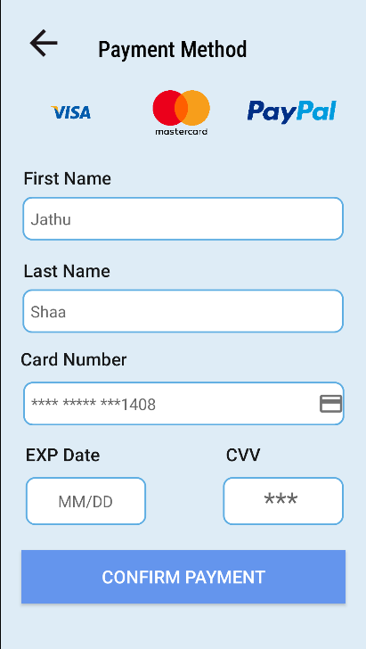

# 🌍 Tour Booking App

Android tour booking mobile application built with Kotlin, featuring authentication, booking management, and payment integration.

## 🛠️ Tech Stack

- 📱 Kotlin
- 🤖 Android Studio

## ✨ Features

- 🔐 User authentication
- 👤 Role-based access
- 📅 Real-time booking management
- 💳 Payment gateway integration
- 🛎️ Admin dashboard
- 🔔 Notifications and trip management

## 📸 Screenshots

| Startup Page | Login Page | Home Page |
|---|---|---|
|  |  |  |

| Destinations Page | Booking Page | Payment Method Page |
|---|---|---|
|  |  |  |
